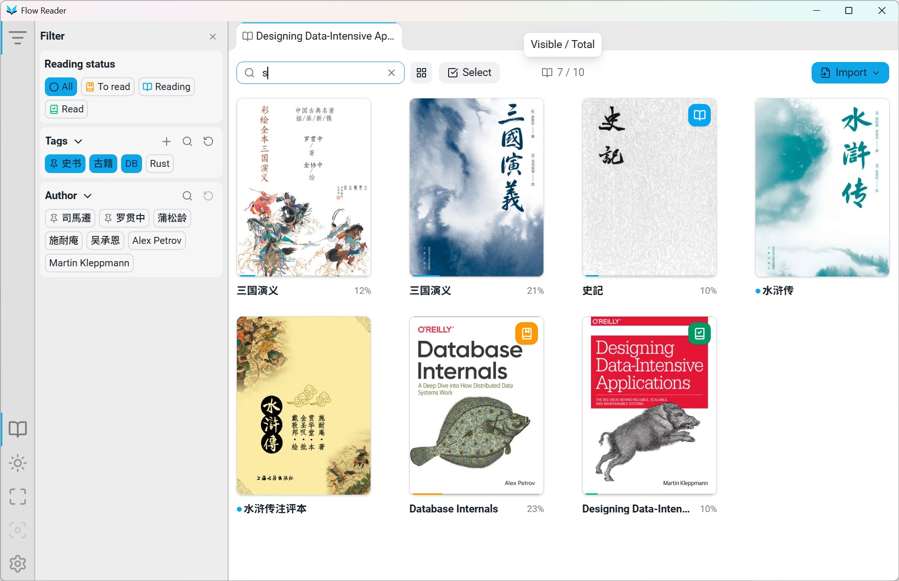
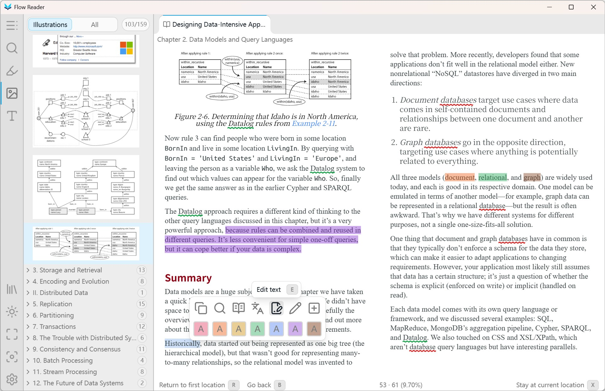
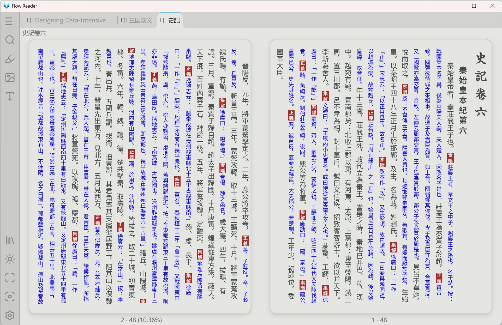
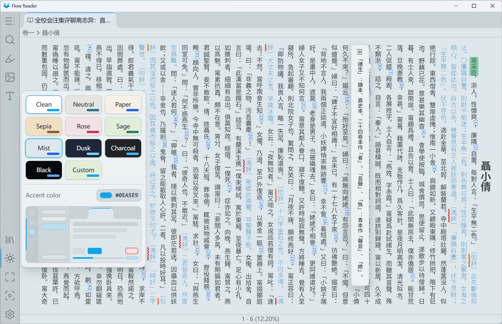

<p align="center">
  
</p>

<h1 align="center">
  Flow Reader
  <br>
  <sub>English · <a href="README_CN.md">简体中文</a></sub>
</h1>

Flow Reader is a fast, smooth, and lightweight desktop reader for EPUB and TXT.
It is built for long, uninterrupted reading: the book stays visually dominant,
the interface remains compact, and frequent actions respond immediately without
breaking concentration.

Hold down an arrow key and every page turn keeps up; switch rapidly between
tabs again and again, and every book is ready immediately. Full-book search
returns results in milliseconds even across millions of characters. Even with
more than 1,200 books in the library and many books open, the app stays smooth
and memory use remains restrained.

## Highlights

### Switch books without losing your place

- The library and every open book stay in one compact, tabbed window. Switch
  between them without opening extra windows or waiting for a reading view to
  reopen.
- Each book retains its exact page and layout while inactive. Tabs can be
  reordered by dragging or keyboard shortcut and are ready the moment you return.
- Page content, chapter context, page number, and progress remain synchronized
  through rapid page turns, resizing, sidebar changes, and display adjustments.

### More EPUBs work as they should

- The maintained EPUB engine handles EPUB 2 and EPUB 3 navigation, reflowable
  and fixed-layout books, left-to-right and right-to-left reading order, and
  traditional vertical Chinese and Japanese text.
- Responsive single- and double-page views preserve page order, fixed-page
  placement, and the exact reading position as the reading area changes.
- Import repairs broken navigation and spine metadata, splits oversized
  single-file chapters, restores missing fixed-layout dimensions, and handles
  embedded fonts and archive paths that would otherwise fail on desktop.
- Bring an entire collection in at once by finding EPUB and TXT books across
  nested folders and turning the existing folder structure into library tags.
- Turn plain-text files into structured books with automatic encoding
  detection, titles and authors derived from filenames, and tailored rules for
  recognizing volumes and chapters.

### Useful tools stay in the reading context

- Select text once to copy it, search the book, open a dictionary, translate,
  add a highlight and note, or mark a term so every occurrence is highlighted
  throughout the book.
- Search the complete book or use chapter find for the current section. Results
  open directly at the matching text.
- Combine online lookup with local StarDict and MDict dictionaries, listen with
  available system voices, and switch between Google and Azure translation
  without leaving the page.
- The Gallery filters common decorative and duplicate images by default, while
  keeping every image available with preview, zoom, fit, rotation controls and
  download.
- Highlights and notes remain useful beyond the page: organize them, export
  them as readable Markdown or structured JSON, and follow links back to the
  exact passages in the book.
- EPUBs stay fast without forcing a choice between speed and disk space, and
  remain just as smooth when edited in place. Correct EPUB or TXT text directly
  on the page, keep reading, and export the revised book when ready.

### The library and reading environment adapt to you

- Built for large collections: tested with more than 1,200 books, the bookshelf
  stays fast while browsing, searching, filtering, and sorting.
- Combine title search with reading status, author, and tag filters; pin frequent
  filters, then update tags or reading status—or delete books—across the filtered
  results in batches.
- Start with a range of carefully balanced light and dark theme presets, or
  create your own from the background and accent colors. Changes appear
  immediately in the app and a live interface preview, making themes quick to
  compare and switch.
- Body-aware typography identifies the main reading text before applying font,
  size, weight, line height, indentation, and alignment. Distinctive typefaces,
  chapter headings, and other intentionally styled elements retain their
  character, so a carefully typeset book can be refined without flattening the
  publisher's design.
- Choose default page view and alignment, then adjust them for each book
  alongside zoom and unframed, card, book, or divider page appearances.
- Fullscreen and Zen mode remove the remaining interface when only the book
  matters.

## Screenshots










## Project Structure

- `src/` - React frontend, including the library, reader, and settings
- `src-tauri/` - Tauri shell, native commands, storage, import, and search
- `packages/epubjs/` - internal EPUB rendering engine
- `crates/` - shared EPUB cover and thumbnail libraries
- `native/shell-thumbnails/` - Windows and macOS EPUB thumbnail integration
- `scripts/` - build, packaging, and release utilities
- `tests/` - unit and browser integration tests

## Development

### Prerequisites

- [Node.js](https://nodejs.org/)
- [pnpm](https://pnpm.io/installation)
- [Rust](https://www.rust-lang.org/tools/install)
- [Tauri](https://v2.tauri.app/start/prerequisites/)

### Install

```bash
pnpm install
```

Install the Chromium and WebKit binaries used by the browser integration tests:

```bash
pnpm exec playwright install chromium webkit
```

### Run

```bash
pnpm tauri:dev
```

### Verify

Run the source checks and production frontend build:

```bash
pnpm check
```

Run an individual test layer:

```bash
pnpm test:unit
pnpm test:integration
```

Run one integration spec:

```bash
pnpm test:integration tests/integration/app-shell.spec.ts
```

Integration tests run in both the Chromium and WebKit projects by
default. Run one engine explicitly when iterating on a focused failure:

```bash
pnpm test:integration:chromium tests/integration/app-shell.spec.ts
pnpm test:integration:webkit tests/integration/app-shell.spec.ts
```

Run one integration test by matching its title:

```bash
pnpm test:integration tests/integration/app-shell.spec.ts -g "loads without client exceptions"
```

Run the complete browser, EPUB engine, and native quality and test suite:

```bash
pnpm check:full
```

### Build

Build the application without creating a distributable package:

```bash
pnpm tauri:build
```

Build the complete local-use package for the current platform. The result is moved to `release/`:

```bash
pnpm bundle:windows:installed
pnpm bundle:macos:installed
pnpm bundle:linux:installed
```

Windows produces an NSIS installer, macOS produces the application bundle, and
Linux produces an AppImage.

## License

Flow Reader is licensed under the [GNU Affero General Public License v3.0](LICENSE).

## Credits

- [pacexy/flow](https://github.com/pacexy/flow)
- [epub.js](https://github.com/futurepress/epub.js/)
- [Tauri](https://tauri.app/)
- [React](https://github.com/facebook/react)
